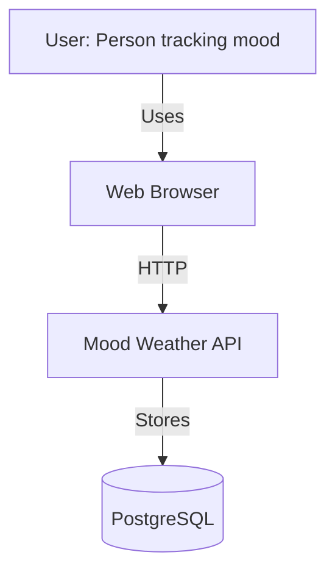
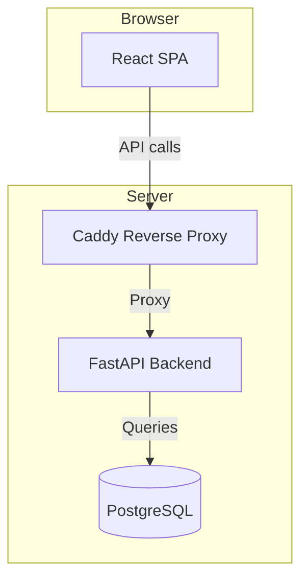
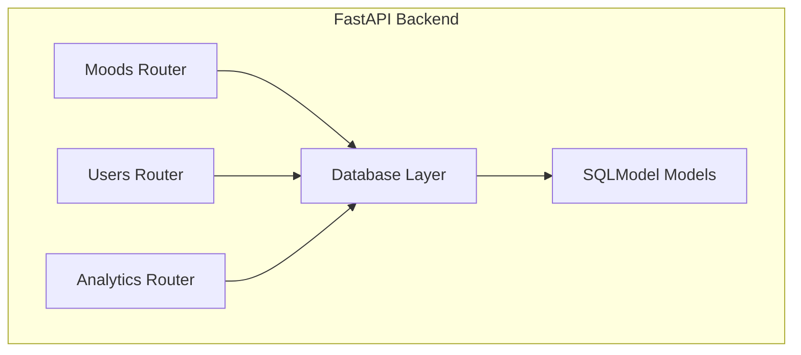
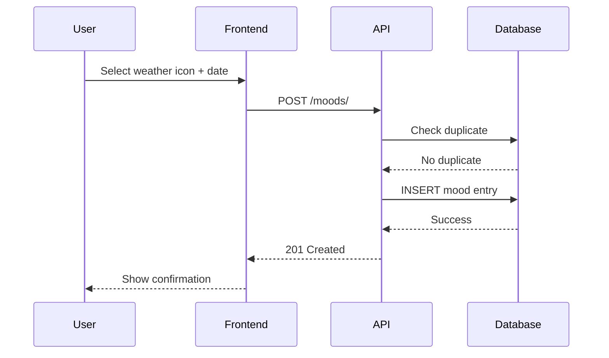
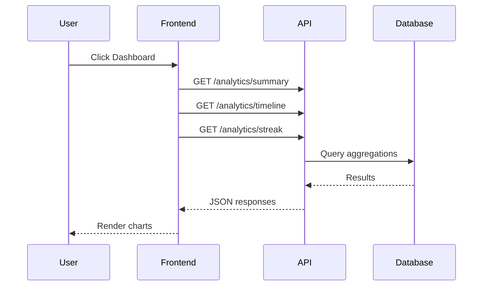

# Architecture

## C4 Model - Context Diagram

## C4 Model - Container Diagram

## C4 Model - Component Diagram

## Sequence Diagram - Create Mood Entry

## Sequence Diagram - View Dashboard

## Design Decisions

1. **Monolith backend**: Simple deployment, all endpoints in one FastAPI app
2. **Async database**: asyncpg for better concurrency handling
3. **SQLModel**: Combines Pydantic + SQLAlchemy for cleaner code
4. **Single-origin proxy**: Caddy eliminates CORS issues
5. **Weather metaphor**: 4 simple mood states for low friction tracking
6. **Date uniqueness**: One entry per user per day (enforced at API level)
